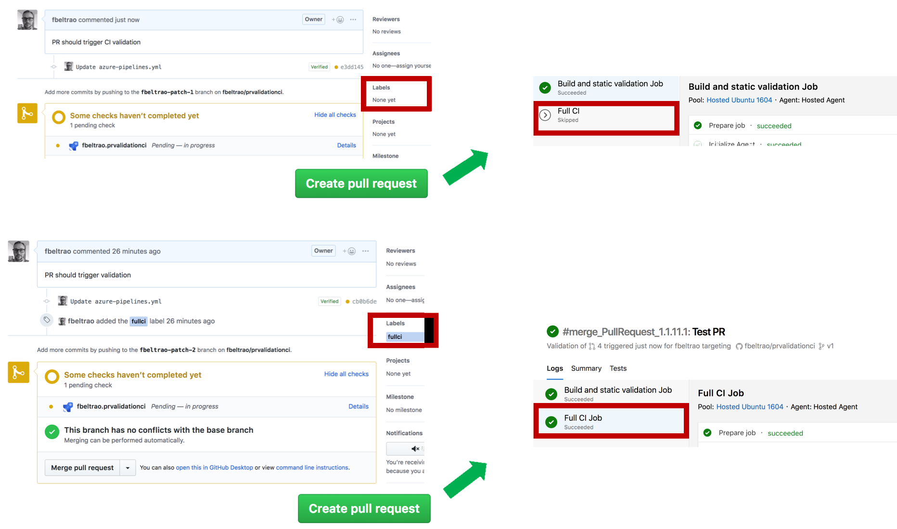
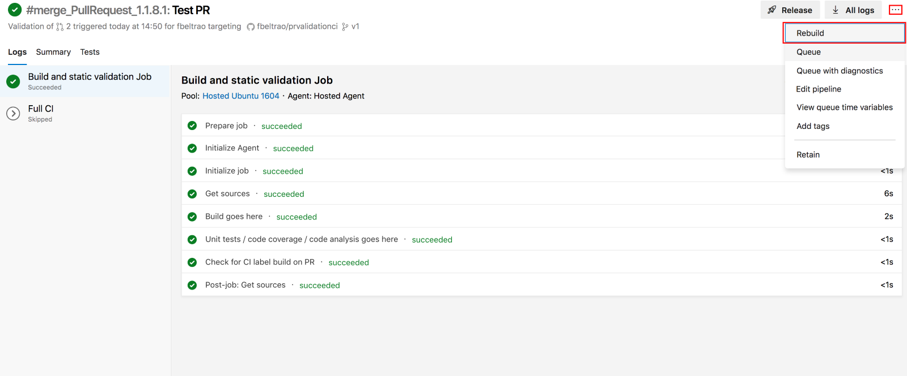
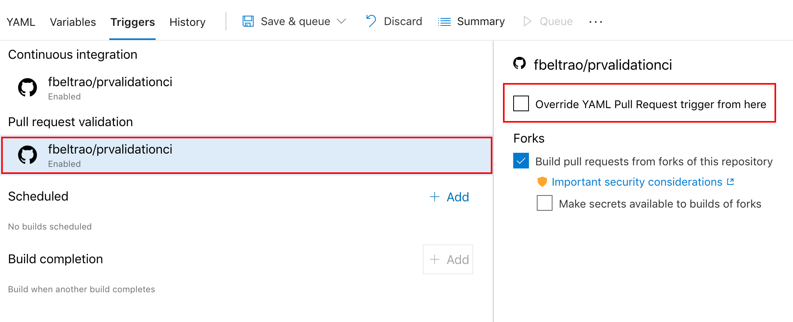

# Pull request validation based on GitHub labels using Azure DevOps

This repository demonstrate how to use Azure DevOps pipelines to validate PRs, customizing job execution based on GitHub Pull Request labels.



Pull request validation is a CI pipeline executed whenever a pull request is submitted. Most of the time they run static validation (check for build errors, unit tests, code coverage, code analysis). They can save us a lot of time, by telling the team whether or not a PR changes fulfils the minimum requirements.

Integration tests can be added to PR validation pipelines. They could deploy to a test environment and execute time consuming integration tests. Ideally integration tests on PR validations should be disabled by default. The team however, can opt-in based on PR. Why?

* Do not add barriers/delays to simple changes. It does not make sense to run integration tests if changes are targeting documentation or parts of the code base not covered by integration test

* For security reasons, team must pre-validate external contributed PRs before running in test environment.

## Solution

The implemented solution uses GitHub pull request labels to identify whether or not the integration tests should be executed. You can find it in the build definition file [azure-pipeline.yml](https://github.com/fbeltrao/prvalidationci/blob/master/azure-pipelines.yml).

1. In a pipeline triggered due to a PR, check if it contains "fullci" label. If found we output a variable named `prHasCILabel` with value true.

```yaml
  # If reason build is started is "PullRequest"
  # Use GitHub API to check if PR has specific label ("fullci")
  # GitHub API: https://api.github.com/repos/{organization-or-name}/{project}/issues/{pr-number}
  # If found, set output variable prHasCILabel to true
  # echo "##vso[task.setvariable variable=prHasCILabel;isOutput=true]true"
  - bash: |
     echo "Looking for label at https://api.github.com/repos/$BUILD_REPOSITORY_ID/issues/$SYSTEM_PULLREQUEST_PULLREQUESTNUMBER/labels"
     if curl -s "https://api.github.com/repos/$BUILD_REPOSITORY_ID/issues/$SYSTEM_PULLREQUEST_PULLREQUESTNUMBER/labels" | grep '"name": "fullci"'
     then
       echo "##vso[task.setvariable variable=prHasCILabel;isOutput=true]true"
       echo "[INFO] fullci label found!"
     fi
    displayName: Check for CI label build on PR
    condition: eq(variables['Build.Reason'], 'PullRequest') # only run step if it is a PR
    name: checkPrLabel
```

2. In integration test pipeline job, use conditions to prevent execution in case pipeline is not building master, dev or a PR with "fullci" label (checking for variable "prHasCILabel" outputted from previous job/step)

```yaml
# This job is executed only if:
# - Commit on master or dev
# - Validation of a PR with 'fullci' label
- job: full_ci
  displayName: Full CI
  dependsOn: build_and_static_validation # depends on previous job
  # conditions to run:
  #  - master/dev commit
  #  - pr with 'fullci' label
  condition: or(in(variables['Build.SourceBranch'], 'refs/heads/master', 'refs/heads/dev'), eq(dependencies.build_and_static_validation.outputs['checkPrLabel.prHasCILabel'], true))
  pool:
    vmImage: 'Ubuntu 16.04'
```

## Re-run PR validation

If the label "fullci" was added later in the process the build can be restarted in Azure DevOps, which in revalidated the PR, updating the checks.



## Important:

Currently by default Azure DevOps is overwriting the PR trigger configuration of the yaml. To follow what is defined in the yaml file, change the build configuration by disabling the "Override YAML Pull Request trigger from here":



Pull request validation in yaml:

```yaml
# On PRs against master and dev
pr:
  branches:
    include:
    - master
    - dev
```

## Adding and removing labels to PR

Using my [GitHubPRLabel task](https://marketplace.visualstudio.com/items?itemName=fbeltrao.GitHubPRLabel&targetId=3456153a-1adb-46c2-af0c-c899f2eac955&utm_source=vstsproduct&utm_medium=ExtHubManageList) to add/remove labels from PRs.

Extension and more information available at https://github.com/fbeltrao/azure-pipeline-github-tasks
